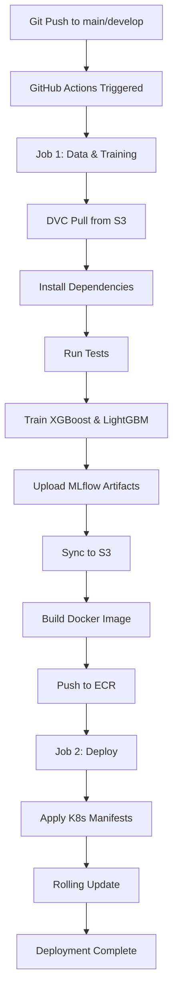

# MLOps CI/CD Workflow Documentation

## Overview

This document describes the complete CI/CD pipeline for the Loan Prediction MLOps project, including DVC data management, model training, and Kubernetes deployment.

## Workflow Architecture



## Pipeline Stages

### Stage 1: Data Management & Training

**Trigger**: Push to `main` or `develop` branch

**Steps**:

1. **Checkout & Setup**
   - Clone repository with full history
   - Set up Python 3.11
   - Configure AWS credentials via OIDC

2. **DVC Data Management**
   ```bash
   # Install DVC with S3 support
   pip install dvc[s3]

   # Pull datasets from S3
   dvc pull
   ```
   - **S3 Location**: `s3://loanpred-mlops-20251118-120330/`
   - **Region**: `eu-west-2`

3. **Install Dependencies**
   ```bash
   pip install -r requirements.txt
   ```

4. **Run Tests**
   ```bash
   pytest test/test_mlops.py -v
   ```

5. **Model Training**
   ```bash
   python -m prediction_model.training_pipeline
   ```
   - Trains XGBoost (Production)
   - Trains LightGBM (Staging)
   - Performs hyperparameter optimization (5 trials each)
   - Logs to MLflow

6. **Artifact Management**
   - Upload MLflow runs to GitHub Actions artifacts
   - Sync MLflow to S3: `s3://loanpred-mlops-20251118-120330/mlruns/`
   - Push DVC changes (if any)

7. **Docker Build & Push**
   - Build Docker image with trained models
   - Tag: `<ECR_REGISTRY>/mlops/loan_pred:<COMMIT_SHA>`
   - Push to Amazon ECR

### Stage 2: Kubernetes Deployment

**Trigger**: Successful completion of Stage 1

**Dependencies**: `needs: data-and-training`

**Steps**:

1. **Setup**
   - Configure AWS credentials
   - Install kubectl
   - Update EKS kubeconfig

2. **Deploy to EKS**
   ```bash
   # Apply manifests
   kubectl apply -f k8s/namespace.yml
   kubectl apply -f k8s/serviceaccount.yml
   kubectl apply -f k8s/services.yml
   kubectl apply -f k8s/deployment.yml

   # Rolling update
   kubectl set image deployment/loan-prediction-deployment \
     loan-prediction=<ECR_REGISTRY>/mlops/loan_pred:<COMMIT_SHA> \
     -n loan-prediction-mlops
   ```

3. **Verification**
   - Wait for rollout completion (5 min timeout)
   - Verify deployment status

## Environment Variables

### GitHub Secrets Required

| Secret Name | Description | Example |
|-------------|-------------|---------|
| `AWS_REGION` | AWS region | `eu-west-2` |
| `EKS_CLUSTER_NAME` | EKS cluster name | `loan-pred-cluster` |
| `ACTIONS_GITHUB_ROLE_ARN` | GitHub Actions OIDC role | `arn:aws:iam::...` |

### Environment Variables (in workflow)

| Variable | Value | Usage |
|----------|-------|-------|
| `ECR_REPOSITORY` | `mlops/loan_pred` | Docker image repository |
| `S3_BUCKET` | `loanpred-mlops-20251118-120330` | Data & artifacts storage |
| `PYTHON_VERSION` | `3.11` | Python runtime version |

## Data Flow

### Training Data
```
Local Development
    ├── datasets/ (gitignored)
    ├── datasets.dvc (tracked in git)
    └── dvc push
         ↓
    S3: s3://loanpred-mlops-20251118-120330/.dvc/
         ↓
GitHub Actions
    └── dvc pull
         ↓
    Training Pipeline
```

### Model Artifacts
```
Training Pipeline
    ├── mlruns/ (local)
    └── MLflow logging
         ↓
    aws s3 sync
         ↓
    S3: s3://loanpred-mlops-20251118-120330/mlruns/
         ↓
Docker Image
    └── Packaged with models
         ↓
    Amazon ECR
         ↓
    EKS Deployment
```

## Manual Workflow Trigger

You can manually trigger the workflow:

```bash
# Via GitHub UI
# Go to Actions → MLOps CI/CD Pipeline → Run workflow

# Or via GitHub CLI
gh workflow run cicd.yml
```

## Local Development Workflow

### 1. Update Datasets

```bash
# Add new data
cp new_data.csv datasets/

# Track with DVC
dvc add datasets/

# Push to S3
dvc push

# Commit metadata
git add datasets.dvc .gitignore
git commit -m "Update training data"
git push
```

### 2. Train Models Locally

```bash
# Install dependencies
pip install -r requirements.txt

# Train
python -m prediction_model.training_pipeline

# Results stored in mlruns/
```

### 3. Push Changes

```bash
git add .
git commit -m "Update model training pipeline"
git push

# CI/CD automatically triggers
```

## Monitoring & Debugging

### Check Workflow Status

```bash
# Via GitHub CLI
gh run list --workflow=cicd.yml

# View latest run
gh run view

# View logs
gh run view --log
```

### Check DVC Status in CI/CD

Look for these log sections:
- `Pull data from S3 via DVC`
- `Train ML models`
- `Sync MLflow artifacts to S3`

### Check Deployment Status

```bash
# Get pods
kubectl get pods -n loan-prediction-mlops

# Check deployment
kubectl get deployment -n loan-prediction-mlops

# View logs
kubectl logs -n loan-prediction-mlops \
  deployment/loan-prediction-deployment
```

## Failure Scenarios & Recovery

### 1. DVC Pull Fails

**Symptom**: "No remote data yet"

**Solution**:
```bash
# Manually push data first
dvc push

# Then re-run workflow
```

### 2. Training Fails

**Symptom**: Model training errors

**Actions**:
- Check GitHub Actions logs
- Verify data quality
- Check MLflow for partial runs

### 3. Deployment Fails

**Symptom**: Rollout timeout

**Actions**:
```bash
# Check pod status
kubectl describe pod <pod-name> -n loan-prediction-mlops

# Check events
kubectl get events -n loan-prediction-mlops --sort-by='.lastTimestamp'

# Rollback if needed
kubectl rollout undo deployment/loan-prediction-deployment \
  -n loan-prediction-mlops
```

## Optimization Tips

### 1. Cache Dependencies

The workflow uses pip caching:
```yaml
- uses: actions/setup-python@v4
  with:
    cache: 'pip'
```

### 2. Parallel Jobs

Training and deployment run sequentially, but you can parallelize:
- Multiple model training jobs
- Testing in separate job

### 3. Conditional Execution

Deploy only if training succeeds:
```yaml
if: needs.data-and-training.outputs.model_trained == 'true'
```

## Best Practices

1. **Always use DVC for data**
   - Never commit datasets to Git
   - Always run `dvc push` after data changes

2. **Test locally first**
   - Run training locally before pushing
   - Verify model quality

3. **Use feature branches**
   - Develop in feature branches
   - Merge to `develop` for testing
   - Merge to `main` for production

4. **Monitor resources**
   - Check S3 bucket size regularly
   - Clean old MLflow runs
   - Monitor ECR image storage

5. **Document changes**
   - Use meaningful commit messages
   - Update this doc when workflow changes

## Metrics & Costs

### Storage

| Resource | Approx. Size | Monthly Cost* |
|----------|--------------|---------------|
| S3 (datasets) | ~70 KB | < $0.01 |
| S3 (MLflow) | ~100 MB | ~$0.02 |
| ECR (images) | ~1 GB | ~$0.10 |

*Estimated, varies by usage

### Execution Time

| Stage | Duration |
|-------|----------|
| DVC Pull | ~10 sec |
| Install deps | ~1 min |
| Training | ~5-10 min |
| Docker build | ~2-3 min |
| Deploy | ~1-2 min |
| **Total** | **~10-17 min** |

## Future Improvements

- [ ] Add data validation step
- [ ] Implement A/B testing deployment
- [ ] Add model performance monitoring
- [ ] Automated rollback on degradation
- [ ] Slack/email notifications
- [ ] Model registry integration
- [ ] Automated data drift detection

## Related Documentation

- [DVC Setup Guide](DVC_SETUP.md)
- [Model Training Pipeline](../prediction_model/training_pipeline.py)
- [Kubernetes Manifests](../k8s/)
- [GitHub Actions Workflows](../.github/workflows/)

## Support

For issues or questions:
1. Check GitHub Actions logs
2. Review this documentation
3. Check DVC documentation: https://dvc.org/
4. Open an issue in the repository
